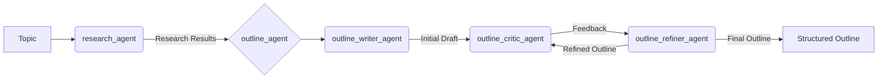

# nthnluu/agents

A collection of personal AI agents built using the [Google Agent Development Kit (ADK)](https://google.github.io/adk-docs/).

## Overview

This repository serves as a personal space for developing and experimenting with various AI agents I'm building for random personal use cases.

## Current Agents

### 1. Video Script Writer

*   **Description:** An agent designed to assist in the creation of YouTube video scripts. It takes a topic, performs research, and generates a structured outline.
*   **Components:**
    *   `research_agent`: Conducts research on the given topic using Google Search.
    *   `outline_agent`: Generates a video script outline based on the research. This agent is composed of:
        *   `outline_writer_agent`: Creates an initial draft of the outline.
        *   `outline_critic_agent`: Reviews the draft and provides feedback.
        *   `outline_refiner_agent`: Refines the outline based on the critic's feedback in an iterative loop.
*   **Location:** [`video_script_writer/`](video_script_writer/)



## Built With

*   [Python](https://www.python.org/)
*   [Google Agent Development Kit (ADK)](https://google.github.io/adk-docs/)

## Getting Started

### Prerequisites

*   Python 3.9+
*   pip (Python package installer)

### Installation & Setup

1.  **Clone the repository:**
    ```sh
    git clone https://github.com/nthnluu/agents.git
    cd agents
    ```

2.  **Create and activate a virtual environment:**
    ```sh
    python -m venv .venv
    source .venv/bin/activate 
    ```

3.  **Install dependencies:**
    ```sh
    pip install -r requirements.txt 
    ```

4.  **Set up environment variables:**
    Copy the example environment file and fill in your details:
    ```sh
    cp example.env .env
    ```
    Then, edit `.env` to add your `GOOGLE_API_KEY` with a [Gemini API key](https://aistudio.google.com/apikey).
    ```
    # .env
    GOOGLE_GENAI_USE_VERTEXAI=FALSE
    GOOGLE_API_KEY=YOUR_API_KEY_HERE
    ```

## Usage

The easiest way to run the agents is to use the beautiful ADK web UI:
```sh
adk web
```

Refer to the [Google ADK documentation](https://google.github.io/adk-docs/) for detailed instructions on running agents.
